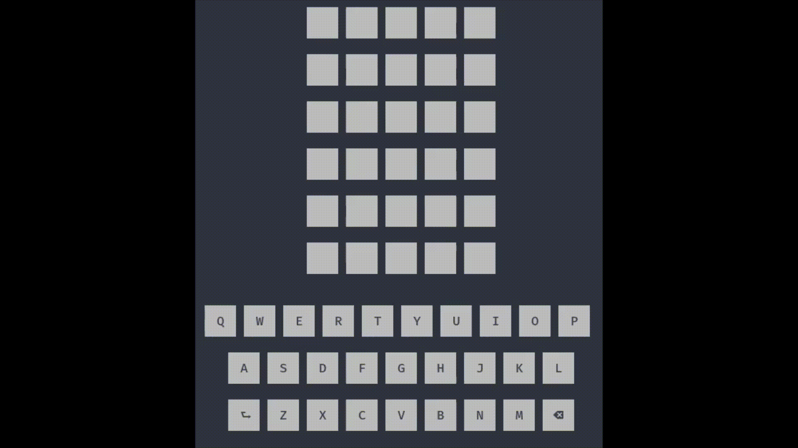

# x86-Assembly-Wordle
Fully working Wordle implement in the x86 Intel Assembly language for linux terminal  

This is a fun project I did to refresh my Assembly skills and to learn how Wordle works. The game plays as normal wordle where the game chooses a 5 letter word for you to solve. If the letter appears green then it is in the right spot, and if it is yellow then it is in the word in another spot. Input can be done with either the keyboard or by clicking the letters on the screen. To see the code idea behind terminal mouse input see: https://github.com/RnMor777/Mouse-Input-BashTerminal  

The game itself loads a word dataset that was taken from the actual Wordle game and selects a random word. When the user enters a word, the game runs a binary search algorithm to determine if the word is a valid word. The valid word options were also taken from Wordle. 

To compile the code you need:
 * nasm
 * gcc-multilib

To compile/run the code do:
 * make
 * ./Wordle

